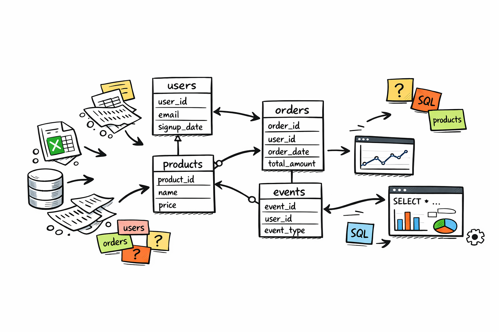

# Data Modeling Challenge

Practice end-to-end data modeling using realistic datasets.

This repository is a self-contained challenge: it includes source data, task prompts, and a place to document your approach and final solution.

## What this challenge covers

- Translating raw operational data into an analytics-friendly model
- Defining entities, relationships, keys, and grain
- Building fact/dimension thinking for transactional and event data
- Documenting assumptions, trade-offs, and modeling decisions

## Repository structure

- [data/](data/) — source datasets and dataset documentation
- [materials/](materials/) — additional materials to study data modeling
- [tasks/](tasks/) — challenge tasks and requirements

## Data modeling tasks

There are six tasks available to solve:

| # | Task | Difficulty | Type |
|---|---|---|---|
| 01 | [Revenue Reporting](tasks/task-01-revenue-reporting/) | ⭐️ | Entity / Fact table |
| 02 | [Product Sales Report](tasks/task-02-product-sales-report/) | ⭐️ | Join + Aggregation |
| 03 | [Star Schema Design](tasks/task-03-star-schema/) | ⭐️⭐️ | Dimensional Modeling |
| 04 | [Hotel Booking Data Marts](tasks/task-04-hotel-booking-marts/) | ⭐️⭐️ | Theoretical / Design-only |
| 05 | [User Conversion Funnel](tasks/task-05-conversion-funnel/) | ⭐️⭐️⭐️ | Window Functions + Funnel |
| 06 | [Sessionization & Cart Abandonment](tasks/task-06-sessionization/) | ⭐️⭐️⭐️ | Advanced Window Functions |

It should be possible to solve challenges in any order.

However, if you're only getting started, I recommend completing them in order. This way you will get a natural progression from fundamentals to more advanced concepts and tasks.

Each task folder contains three files.

A `README.md` file contains the task description:
- **Context** – the business problem
- **Goal** – what to build
- **Requirements** – constraints and rules to follow
- **Hints** – syntax nudges and common pitfalls

A `THEORY.md` file contains necessary theory to accomplish the task. Beginners will find helpful theoretical knowledge and definitions to get started with the task. The file also contains useful directions if you get stuck or are lost on the task.

`SOLUTION.md` file is your space. Feel free to describe your solution, your thinking process, assumptions and trade-offs. Also explain any assets (images or scripts) that you are attaching with the solution.

## Suggested workflow

1. **Understand the source model**  
	Inspect each table, identify entity boundaries, and note data quality constraints.
2. **Define target model**  
	Decide on analytical grain, fact tables, dimension tables, and key relationships.
3. **Document assumptions**  
	Capture unclear business rules and how you resolved them.
4. **Validate consistency**  
	Reconcile totals, record counts, and foreign-key relationships where possible.
5. **Present final artifacts**  
	Provide diagrams, table definitions, and concise rationale.

## Expected deliverables

- A conceptual data model defined on a whiteboard
- A logical data model presented as ERD schema
- And a physical model defined as one or multiple SQL files
- Documentation that will explain your key assumptions and design trade-offs
- Additionally, you can provide table/column documentation and notes on validation checks you performed

## Notes

- Keep your solution practical and explainable.
- Prefer clarity over unnecessary complexity.
- Make assumptions explicit when requirements are ambiguous.
