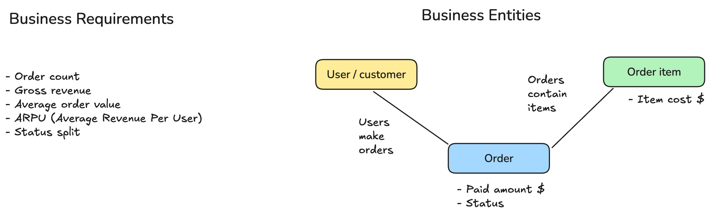
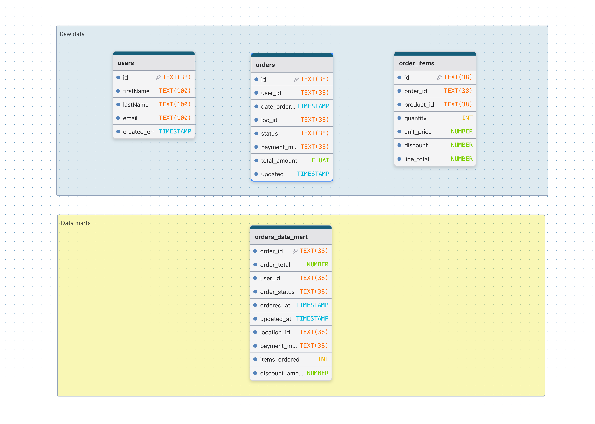

# Solution 01 – Revenue Reporting

## Conceptual Layer



First I just tried to figure out which real-world things matter for this task, ignoring all the table/column stuff for now.

The way I see it, there are three main things going on:

- **Customer** — someone who has an account and can buy stuff
- **Order** — one purchase a customer made
- **Order Item** — a single product line within that purchase

I noticed there are also `Products` and `Locations` tables in the dataset, but I decided to leave them out — the task is asking about revenue at the order level, and everything I need for that is already in the order items. No need to drag in product details or shipping locations.

The relationships between these three things are pretty straightforward:

```
Customer ──< Order ──< Order Item
```

A customer can have many orders, and each order can have many line items. That's it.

Now, the output I want is one row per order that tells me: who placed it, when, what status it's in, and how much money it made. Once I have that, I can calculate any metric I need — total revenue, average order value, revenue per user, breakdowns by status, etc.

| Metric | How I'd calculate it |
|---|---|
| **Order count** | `COUNT(order_id)` |
| **Gross revenue** | `SUM(gross_revenue)` |
| **Average Order Value (AOV)** | `SUM(gross_revenue) / COUNT(order_id)` |
| **ARPU** | `SUM(gross_revenue) / COUNT(DISTINCT user_id)` |
| **Revenue by status** | `GROUP BY status` |


## Logical Layer



Here I mapped out the actual tables and columns I'll be working with. I'm keeping it database-agnostic for now, just types and relationships.

### Source tables I'm using

- **`users`** — I only need `id` to link orders back to a customer and `user_id` for ARPU calculations.
- **`orders`** — the main table. I'm pulling `id`, `user_id`, `date_ordered`, `status`, and `payment_method`. I'm skipping `total_amount` — see design decisions below.
- **`order_items`** — this is where the actual money is. I'm using `order_id`, `quantity`, and `line_total` (which already accounts for discounts).

### Output: `fct_orders`

One row per order. Here's what I want in the final table:

| Column | Type | Where it comes from | Notes |
|---|---|---|---|
| `order_id` | UUID | `orders.id` | PK |
| `user_id` | UUID | `orders.user_id` | |
| `date_ordered` | TIMESTAMP | `orders.date_ordered` | |
| `status` | VARCHAR | `orders.status` | |
| `payment_method` | VARCHAR | `orders.payment_method` | |
| `total_items` | INTEGER | `SUM(order_items.quantity)` | |
| `gross_revenue` | DECIMAL(10,2) | `SUM(order_items.line_total)` | summed from items, not from `orders.total_amount` |


### Design decisions I made

1. **I'm using `order_items.line_total` for revenue, not `orders.total_amount`.** The `total_amount` column on `orders` feels like a derived/cached value — it might be out of sync. The line items are the ground truth, so I'd rather sum those up myself. If they ever differ, that's a data quality problem worth flagging.

2. **I kept cancelled orders in.** I didn't filter them out at the model level. If someone wants only delivered orders, they can filter on `status` themselves. The model shouldn't make that decision for them.

3. **I aggregated `order_items` before joining.** This is important — if I just joined `orders` to `order_items` directly, I'd get one row per line item, not per order. So I group by `order_id` first, then join. Otherwise the row count explodes and revenue gets double-counted.


## Physical Layer

### `fct_orders`

```sql
-- Aggregate order_items first so we don't get duplicate order rows
WITH order_aggregates AS (
    SELECT
        order_id,
        SUM(quantity)   AS total_items,
        SUM(line_total) AS gross_revenue
    FROM order_items
    GROUP BY order_id
)

SELECT
    o.id               AS order_id,
    o.user_id,
    o.date_ordered,
    o.status,
    o.payment_method,
    COALESCE(oa.total_items, 0)   AS total_items,
    COALESCE(oa.gross_revenue, 0) AS gross_revenue
FROM orders o
LEFT JOIN order_aggregates oa ON oa.order_id = o.id
ORDER BY o.date_ordered;
```

### Validation queries

```sql
-- 1. Make sure there's one row per order (no fan-out)
SELECT COUNT(*) AS total_rows, COUNT(DISTINCT order_id) AS distinct_orders
FROM (
    SELECT o.id AS order_id
    FROM orders o
) t;

-- 2. Top-level business metrics
SELECT
    COUNT(order_id)                                        AS order_count,
    SUM(gross_revenue)                                     AS total_gross_revenue,
    ROUND(SUM(gross_revenue) / COUNT(order_id), 2)         AS aov,
    ROUND(SUM(gross_revenue) / COUNT(DISTINCT user_id), 2) AS arpu
FROM (
    SELECT
        o.id               AS order_id,
        o.user_id,
        COALESCE(oa.gross_revenue, 0) AS gross_revenue
    FROM orders o
    LEFT JOIN (
        SELECT order_id, SUM(line_total) AS gross_revenue
        FROM order_items
        GROUP BY order_id
    ) oa ON oa.order_id = o.id
) fct;

-- 3. Revenue split by status
SELECT
    status,
    COUNT(order_id)                                                          AS order_count,
    ROUND(SUM(gross_revenue), 2)                                             AS revenue,
    ROUND(SUM(gross_revenue) / SUM(SUM(gross_revenue)) OVER () * 100, 1)    AS revenue_pct
FROM (
    SELECT
        o.id               AS order_id,
        o.status,
        COALESCE(oa.gross_revenue, 0) AS gross_revenue
    FROM orders o
    LEFT JOIN (
        SELECT order_id, SUM(line_total) AS gross_revenue
        FROM order_items
        GROUP BY order_id
    ) oa ON oa.order_id = o.id
) fct
GROUP BY status
ORDER BY revenue DESC;

-- 4. Revenue discrepancy check (orders where stored total != items sum)
SELECT
    order_id,
    stored_total,
    items_total,
    revenue_discrepancy
FROM (
    SELECT
        o.id                                                           AS order_id,
        o.total_amount                                                 AS stored_total,
        COALESCE(oa.gross_revenue, 0)                                  AS items_total,
        ROUND(ABS(o.total_amount - COALESCE(oa.gross_revenue, 0)), 2)  AS revenue_discrepancy
    FROM orders o
    LEFT JOIN (
        SELECT order_id, SUM(line_total) AS gross_revenue
        FROM order_items
        GROUP BY order_id
    ) oa ON oa.order_id = o.id
) t
WHERE revenue_discrepancy > 0
ORDER BY revenue_discrepancy DESC;
```
