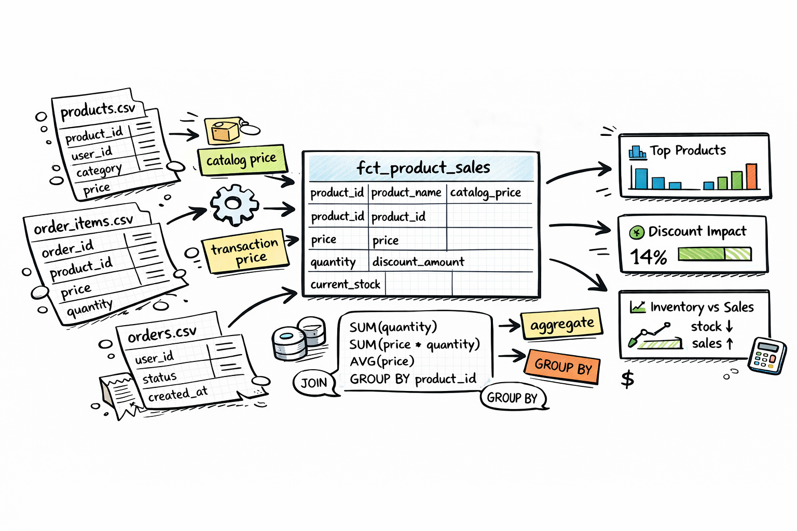

# Task 02 – Product Sales Report

**Difficulty**: Easy ⭐️

**Data source**: data/ecommerce

**Theory**: [Grain Choices, Aggregation Patterns, and Join Safety](THEORY.md)

## Context

The merchandising team needs to understand how each product is selling. They want to compare actual transaction prices against the catalog price, understand discount exposure, and see current stock levels alongside sales velocity — all in a single product-level view.

## Goal

Build a **product-level sales report** with one row per product. All sales metrics should reflect only non-cancelled orders.

In this exercise you should use the **following files**:

- `data/ecommerce/products.csv`
- `data/ecommerce/order_items.csv`
- `data/ecommerce/orders.csv`

## Deliverables

1. `1-conceptual-layer.png`: a conceptual layer diagram. Use [excalidraw](https://excalidraw.com/) or a similar app.
1. `2-logical-layer.png`: draw the logical layer in [DrawDB](https://www.drawdb.app).
1. `3-physical-layer.sql`: a script with data models (SELECT-only). Use [PondPilot](pondpilot.io) to upload the source data and create SQL.

## Hints

Hint 1. Required output columns

| Column | Description |
|---|---|
| `product_id` | Product UUID |
| `product_name` | Product display name (`products.name`) |
| `category` | Product category (`Living Room`, `Bedroom`, or `Kitchen`) |
| `catalog_price` | Current list price from `products.price` |
| `stock` | Current inventory quantity from `products.stock` |
| `times_ordered` | Number of distinct orders containing this product (non-cancelled only) |
| `units_sold` | Total `quantity` sold across non-cancelled line items |
| `distinct_buyers` | Number of distinct users who purchased this product |
| `total_revenue` | Sum of `line_total` across non-cancelled line items |
| `total_discount` | Sum of `discount` across non-cancelled line items |
| `avg_selling_price` | Average `unit_price` at which the product was sold |
| `price_diff` | `avg_selling_price - catalog_price` (positive = sold above catalog, negative = below) |

Hint 2. Additional guidance

- Aggregate `order_items` (filtered to non-cancelled orders) into a product-level CTE first, then `LEFT JOIN` that to `products` — this avoids accidentally dropping unsold products when filtering.
- `distinct_buyers` requires `COUNT(DISTINCT orders.user_id)` since `user_id` lives on `orders`, not `order_items`.
- In the current dataset `quantity` is always `1`, so `units_sold` and `times_ordered` will likely be equal — but model against the column definition, not the observed shortcut.
- `avg_selling_price` should only be computed when `times_ordered > 0`; use `NULLIF(times_ordered, 0)` in the denominator to avoid division-by-zero.
- Join `order_items` to `products` on `order_items.product_id = products.id`.
- Join `order_items` to `orders` on `order_items.order_id = orders.id` to access order status and `user_id`.
- **Exclude cancelled orders** (`orders.status = 'cancelled'`) from all sales metrics.
- Include **all products** in the output, even those with zero sales — use a `LEFT JOIN` from `products` into the sales aggregation.
- For products with no sales, numeric metric columns should be `0` (use `COALESCE`); `avg_selling_price` and `price_diff` should be `NULL`.

Hint 3. Stretch goal

- Add a `sell_through_rate` column defined as `units_sold / NULLIF(products.stock + units_sold, 0)`.
- Discuss assumptions required for this estimate (for example, static stock snapshot vs. historical inventory movement).

