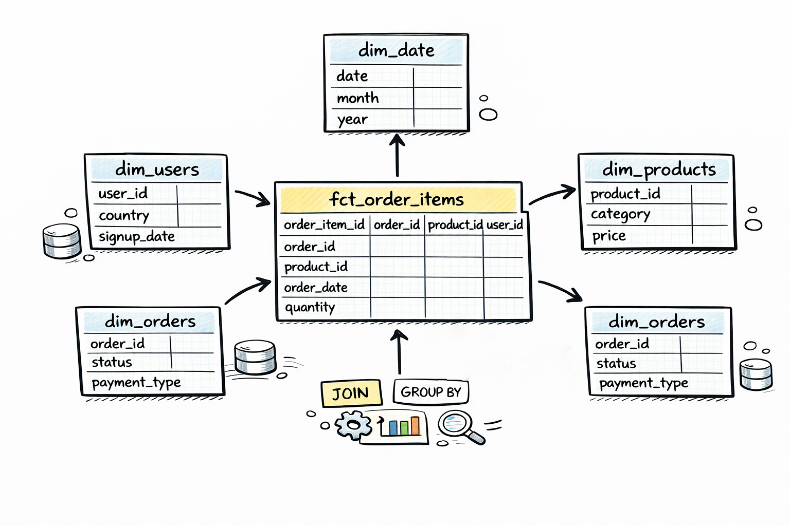

# Task 03 – Star Schema Design

Restructure the e-commerce data into a star schema centred on order line items.

**Difficulty**: Medium ⭐️⭐️

The **task** is here: [TASK.md](TASK.md)
**Theory**: [Dimensional Modeling: Facts, Dimensions, and the Star Schema](THEORY.md)
**Solution** template: [SOLUTION.MD](SOLUTION.MD)